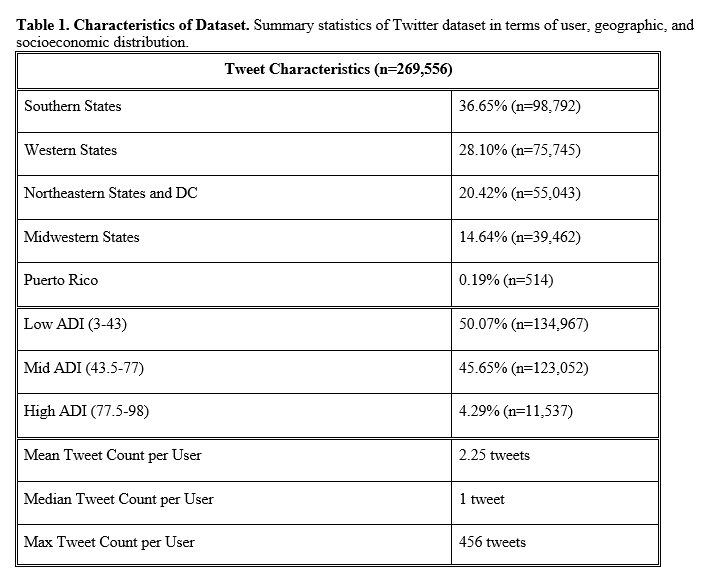

**Twitter-based analysis reveals differential COVID-19 concerns across areas with socioeconomic disparities**  

Yihua Su1*, Aarthi Venkat2*, Yadush Yadav1, Lisa B. Puglisi3,4, Samah J. Fodeh1,2,5  

1 Health Informatics Program, Yale School of Public Health, New Haven, CT, USA  
2 Computational Biology and Bioinformatics Program, Yale University, New Haven, CT, USA  
3 SEICHE Center for Health and Justice, Yale School of Medicine, New Haven, CT, USA  
4 Pain Research, Informatics, Multimorbidities and Education Center, VA Connecticut Healthcare System, West Haven, CT, USA  
5 Department of Emergency Medicine, Yale School of Medicine, New Haven, CT, USA  

*Co-first authors, contributed equally to this work  

Tweets not provided on Github due to privacy concerns.  
